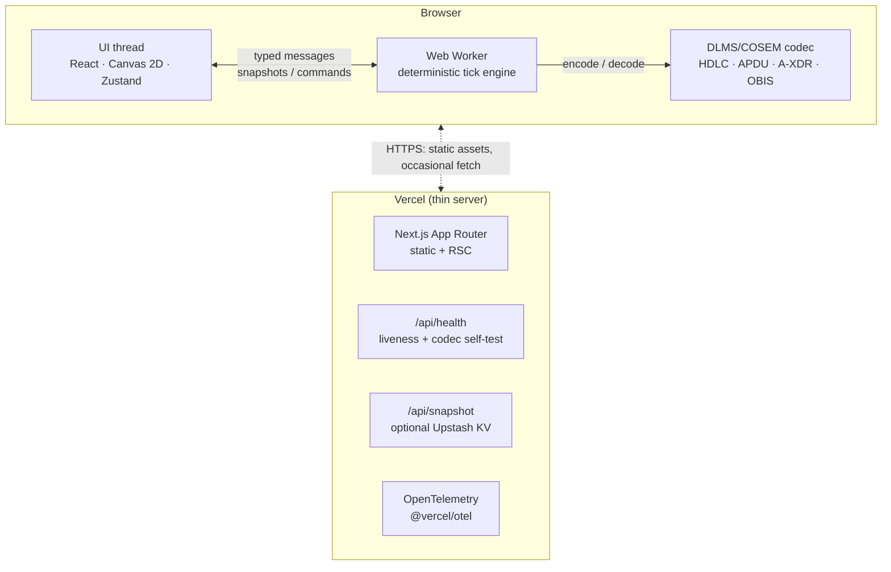
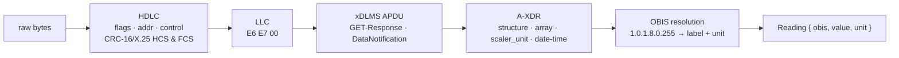

# MeshVigil

[Português](README.md) · **English**

**An AMI mesh simulator and observability console, with a real DLMS/COSEM parser at its core.**

[](https://github.com/igorjba/meshvigil/actions/workflows/ci.yml)
[](LICENSE)

<p align="center">
  
</p>

[Getting started](#getting-started) · [Guarantees](#guarantees)

---

## Overview

Smart electricity meters talk over radio, not wire. In an AMI (Advanced Metering
Infrastructure) network, thousands of meters self-organise into a radio mesh and
forward their readings, hop by hop, to collection points wired back to the
utility. The hard problem shows up when a radio link degrades or a collection
point goes down: the network has to reorganise itself, unattended, so readings
keep arriving. MeshVigil reproduces that entire network inside the browser — the
mesh, the routing, the failures and the recovery — and shows what happens in real
time.

The system is built around verifiable invariants, not appearance. The simulation
engine is deterministic: the same initial state and the same command log produce
exactly the same output, with no call to `Math.random()` anywhere. Every
telemetry reading travels as a real DLMS/COSEM frame — the same protocol real
meters speak — and is decoded back byte for byte. The mesh root cannot be taken
down by fault injection, and radio degradation never exceeds the configured cap.
The simulation runs entirely client-side, which removes the class of server
failures from a demo.

That is why this document opens with the guarantees: each claim above maps to a
test, and the table below carries the command that proves each one before any
feature description.

## Guarantees

Each strong invariant of the system, with the command that verifies it:

| Invariant | Command that proves it |
| --- | --- |
| The codec re-decodes exactly what it encoded — encode and decode never drift apart. | `npx vitest run -t "encoder ↔ parser round-trip"` |
| Every reading the engine emits decodes back to the reading that produced it. | `npx vitest run -t "every emitted frame parses back"` |
| A frame with an invalid CRC is flagged, never treated as valid. | `npx vitest run -t "flags a corrupt FCS"` |
| The same seed and command log produce identical output. | `npx vitest run -t "produces identical output"` |
| RF degradation never exceeds the configured cap. | `npx vitest run -t "degrades RF up to the cap"` |
| The head-end (mesh root) cannot be taken down by chaos. | `npx vitest run -t "refuses the head-end"` |
| The health check answers `200` only if the codec decodes a known frame. | `npx playwright test health` |
| The console has no WCAG 2.1 A/AA accessibility violations. | `npx playwright test a11y` |

## Getting started

```bash
npm install
npm run dev            # http://localhost:3000 — no config needed
```

The demo needs no login and seeds itself: the simulation is live the moment the
page loads.

### Scripts

```bash
npm run dev            # dev server
npm run build          # production build
npm run typecheck      # tsc --noEmit
npm run lint           # eslint (flat config)
npm run test           # unit tests (Vitest)
npm run coverage       # unit tests + coverage thresholds
npm run e2e            # Playwright end-to-end (drives a real browser)
```

---

## Architecture

The entire simulation runs **client-side in a Web Worker**. The worker owns the
authoritative state and advances it on a timer; the UI thread renders a
projection of each snapshot. The server is deliberately thin.



### Determinism

The engine is a pure function of `(seed, tick, chaos events)`. No `Math.random()`
is called anywhere — every stochastic draw comes from a seeded PRNG (mulberry32)
mixed with the current tick. Same seed and the same command log produce
byte-identical output. That is what makes the engine unit-testable, what makes a
shared snapshot reproducible, and what would let a browser and a server agree on
state without a live connection.

```ts
const a = run(createEngine(config), 20, commands);
const b = run(createEngine(config), 20, commands);
expect(snapshot(a.state, a.sla)).toEqual(snapshot(b.state, b.sla)); // ✓ always
```

### The DLMS/COSEM codec

DLMS/COSEM (IEC 62056) is the dominant smart-metering protocol worldwide.
MeshVigil implements a genuine subset of it — not a mock. Every telemetry reading
the engine emits is **encoded** into an on-the-wire frame, and the inspector
**decodes** those exact bytes back:

```
7E A0 33 03 23 13 …            HDLC frame  (flags, format, addresses, control, HCS/FCS)
   └─ E6 E7 00                 LLC header  (response direction)
      └─ 0F 00 00 00 01 …       xDLMS APDU  (DataNotification)
            └─ 02 02 …          A-XDR data  (structure → array of captures)
                 └─ 09 06 01 00 01 08 00 FF   OBIS 1.0.1.8.0.255 → "Active energy import (+A), total"
                 └─ 06 00 12 D6 87            double-long-unsigned → 1 234 567 Wh
```

The decode path is layered and each layer is independently tested:



What makes it real:

- **CRC-16/X.25** header and frame check sequences are computed and verified — a corrupted frame is caught, not trusted. There is a sample frame in the inspector with a deliberately flipped byte, and the e2e confirms it surfaces a failed FCS.
- **A-XDR** decoding of the COSEM `Data` CHOICE: integers of every width, floats, octet/visible strings, booleans, enums, `date-time`, and nested `array` / `structure`.
- **OBIS** codes are resolved against a catalogue of standard registers (energy, power, voltage, current, clock, identity…).
- A full **encoder ↔ parser round-trip** is covered by unit tests, so the two directions cannot silently drift apart.

The code lives in [`src/lib/dlms`](src/lib/dlms), with tests in
[`dlms.test.ts`](src/lib/dlms/dlms.test.ts) and [`codec.test.ts`](src/lib/dlms/codec.test.ts).

### The mesh & RF model

- Meters cluster into neighbourhoods around collectors; links form by a **log-distance path-loss** model (RSSI, SNR, link quality).
- **Reconvergence** is a Dijkstra from the head-end every tick, cost `1/quality` so it prefers fewer hops but avoids weak links — the trade a real RPL/AODV objective function makes.
- Collector→head-end is **always-on backhaul** (cellular/fibre), immune to RF noise — which is exactly why a single collector loss is survivable and the network heals.

### Chaos, impact and recovery

| Action | What it does | Observed effect |
| --- | --- | --- |
| **Kill collector** | Forces a backhaul node offline | Its neighbourhood reroutes; hop counts rise; the mesh heals |
| **Degrade RF** | Raises the noise floor step by step | Weak links drop first; past the percolation threshold availability collapses |
| **Partition** | Severs links across a split line | The RF mesh splits into islands |
| **Cut link / kill node** | Targeted single-element failure | Local reroute |
| **Restore** | Clears every fault | Availability recovers; MTTR is recorded |

### Stack

| Area | Choice |
| --- | --- |
| Framework | Next.js 16 (App Router) · React 19 |
| Language | TypeScript 5.9 (strict, `noUncheckedIndexedAccess`) |
| Styling | Tailwind CSS v4 |
| State | Zustand 5 |
| Simulation | Web Worker · deterministic tick engine · Canvas 2D |
| Testing | Vitest 4 (unit) · Playwright (e2e) |
| Observability | @vercel/otel · health check · error boundaries |
| Persistence (optional) | Upstash Redis |
| CI/CD | GitHub Actions · Vercel |

### Project structure

```
src/
  app/                 # App Router: console page, /sobre, error boundaries, API routes
    api/health         # liveness probe that self-tests the DLMS codec
    api/snapshot       # optional snapshot persistence (Upstash)
  components/
    console/           # SLA, chaos, telemetry, event log, DLMS inspector, top bar
    topology/          # Canvas renderer with packet-flow animation
    ui/                # primitives (panel, stat tile, status dot)
  hooks/               # useSimulation — boots the worker, exposes actions
  lib/
    dlms/              # the DLMS/COSEM codec (bytes, HDLC, A-XDR, COSEM, OBIS, encoder)
    engine/            # deterministic mesh engine (rng, topology, routing, telemetry, chaos, sla)
    worker/            # typed worker protocol + controller
  store/               # Zustand store (render-ready projection)
instrumentation.ts     # OpenTelemetry registration
e2e/                   # Playwright specs
```

---

## Alternatives considered

The alternatives that were weighed and set aside, with the reasoning:

- **Server-driven ticks (Redis + Vercel Cron + SSE).** _Rejected._ Hobby cron runs about once a day and SSE handlers hit function timeouts — the exact opposite of a system that stays up, and it forces an external dependency onto a demo that should just work.
- **Rust → WASM engine.** _Deferred._ Adds a toolchain and a real deploy-breakage risk for a performance win that doesn't exist at this scale. A TypeScript Web Worker already delivers zero-cost client-side execution and stays trivially testable in Node.
- **WebSocket transport.** _Rejected._ Serverless functions don't hold long-lived sockets. With the engine in the browser there is nothing to connect to — the transport problem disappears.
- **Bleeding-edge TypeScript 7 / ESLint 10.** _Deferred._ The two tools most likely to break the build's bundled type-checker were pinned to their proven majors. Latest everywhere it's safe (Next 16, React 19, Tailwind 4, Vitest 4); conservative on the deploy-critical path.

## Benchmarks

Engine throughput advancing a fixed world, measured with `npm run bench` (Vitest)
on an Intel Core i7-6700 @ 3.40 GHz, Node 24:

| Config | Ticks/s |
| --- | --- |
| 48 meters · 4 collectors | ~550 |
| 200 meters · 8 collectors | ~79 |

Each tick reconverges the whole mesh (Dijkstra from the head-end) and emits the
cycle's telemetry, so per-tick cost grows with network size. Reproducible with
`npm run bench`.

## Testing

- **Unit (Vitest).** Cover the DLMS codec (`src/lib/dlms`) and the mesh engine (`src/lib/engine`) — the two pure, load-bearing parts of the system. CI enforces coverage thresholds over that core: 85% lines, 85% functions, 78% branches (`vitest.config.ts`). Run with `npm run coverage`.
- **End-to-end (Playwright).** Drive a real Chromium against the app: the console (`e2e/console.spec.ts`) — checking Web Worker boot, telemetry streaming, chaos injection and the DLMS inspector surfacing FCS ok/failed — and `/api/health` (`e2e/health.spec.ts`). Run with `npm run e2e`.
- **Accessibility (axe-core).** `e2e/a11y.spec.ts` runs axe-core against the rendered console and fails on any WCAG 2.1 A/AA violation. Run with `npx playwright test a11y`.
- The worker and controller (`src/lib/worker`) are covered by the e2e layer, not the unit layer — a scope decision declared in `vitest.config.ts`.

## Observability

- **`GET /api/health`** returns `200`/`503` and runs the DLMS codec against a known-good frame — a green check means the core actually works, not just that the server answered.
- **OpenTelemetry** is wired through `@vercel/otel`; spans flow into Vercel's pipeline with zero config on deploy.
- **Error boundaries** (`error.tsx`, `global-error.tsx`) keep a render fault contained and recoverable.

## Security & accessibility

- Tight **Content-Security-Policy**, **HSTS** and the usual hardening headers (`next.config.ts`); the only server writes (optional snapshots) validate their input.
- Full keyboard operation, visible focus rings, ARIA roles and `prefers-reduced-motion` support (`src/app/globals.css`). The console passes **axe-core** (WCAG 2.1 A/AA) with zero violations, verified by `npx playwright test a11y`.

## Limitations

What the project deliberately does not do:

- Implements a **subset** of DLMS/COSEM aimed at decoding readings (push / GET-Response); it does not implement the application security layer (ciphering, HLS authentication) or the protocol's write services.
- The network, meters and telemetry are **synthetic**; the system does not talk to physical hardware or perform real radio I/O.
- The optional snapshots (Upstash) have no authentication or access control.
- The worker and controller have no unit coverage — only e2e.

## Deploy to Vercel

1. Push to GitHub.
2. Import the repo in Vercel — it auto-detects Next.js. No environment variables are required.
3. _(Optional)_ set `UPSTASH_REDIS_REST_URL` / `UPSTASH_REDIS_REST_TOKEN` to enable shareable snapshots.

Because the simulation is client-side, the Hobby plan is enough — there is no
persistent process, no cron dependency, and nothing to fall over a function
timeout.

## License

All rights reserved by Igor Bahia. See [LICENSE](LICENSE).

Author: Igor Bahia · [github.com/igorjba](https://github.com/igorjba)
