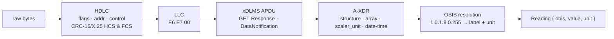
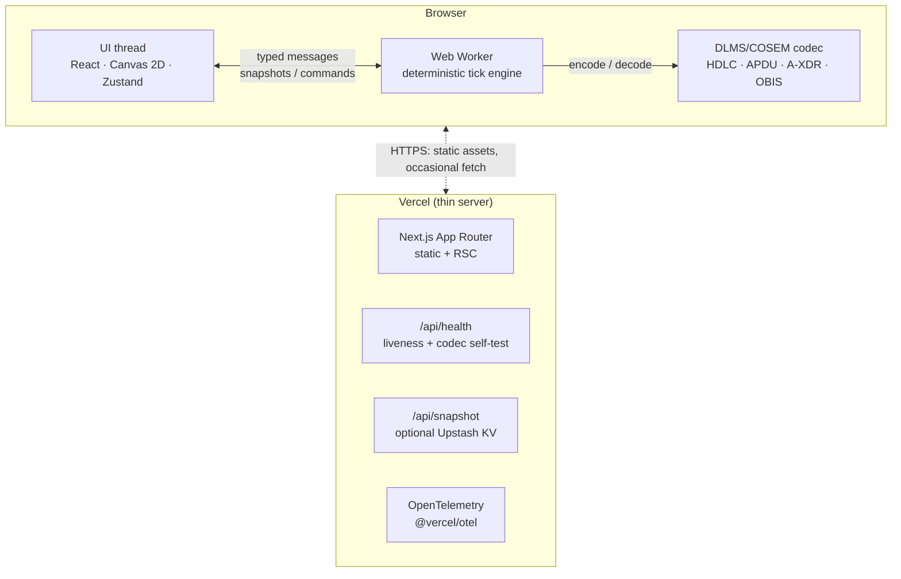

# MeshVigil

[Português](README.md) · **English**

**An AMI mesh simulator & observability console — with a real DLMS/COSEM frame parser at its core.**

MeshVigil simulates an RF‑mesh network of smart electricity meters routing through collectors to a head‑end: synthetic telemetry, live mesh reconvergence, chaos injection, and an SLA panel — all backed by a genuine DLMS/COSEM codec that encodes every reading to bytes and decodes them back to objects.

> _A good system is one that stays up._ Inject a collector failure, degrade the RF, or partition the network, and watch the mesh reconverge.

<p align="center">
  
</p>

---

## What it does

- **Industrial protocol** — a real DLMS/COSEM (IEC 62056) decoder: HDLC framing with CRC‑16/X.25, xDLMS APDUs, A‑XDR data types, OBIS code resolution.
- **Distributed systems** — mesh routing that reconverges every tick, partition detection, backhaul vs RF modelling.
- **Chaos engineering** — targeted fault injection and observable recovery.
- **Observability** — availability, read‑success, MTTR, OpenTelemetry, a health probe that self‑tests the codec.
- **Client‑side by design** — it runs for free on Vercel Hobby and cannot fall over a serverless timeout, because the simulation runs entirely in the browser.

The [architecture section](#architecture) covers the trade‑off behind that last point.

## Live demo & video

- **Live:** _deploy to Vercel and drop the URL here_
- **2‑minute walkthrough:** _link the chaos‑injection video here_

The demo needs no login and seeds itself — it is live the moment the page loads.

---

## The heart: a real DLMS/COSEM codec

DLMS/COSEM is the dominant smart‑metering protocol worldwide. MeshVigil implements a genuine subset of it — not a mock. Every telemetry reading the engine emits is **encoded** into an on‑the‑wire frame, and the inspector **decodes** those exact bytes back:

```
7E A0 33 03 23 13 …            HDLC frame  (flags, format, addresses, control, HCS/FCS)
   └─ E6 E7 00                 LLC header  (response direction)
      └─ 0F 00 00 00 01 …       xDLMS APDU  (DataNotification)
            └─ 02 02 …          A-XDR data  (structure → array of captures)
                 └─ 09 06 01 00 01 08 00 FF   OBIS 1.0.1.8.0.255 → "Active energy import (+A), total"
                 └─ 06 00 12 D6 87            double-long-unsigned → 1 234 567 Wh
```

The decode path is layered and each layer is independently tested:



What makes it real:

- **CRC‑16/X.25** header and frame check sequences are computed and verified — a corrupted frame is caught, not trusted. (There is a sample frame in the inspector with a deliberately flipped byte to prove it.)
- **A‑XDR** decoding of the COSEM `Data` CHOICE: integers of every width, floats, octet/visible strings, booleans, enums, `date-time`, and nested `array` / `structure`.
- **OBIS** codes are resolved against a catalogue of standard registers (energy, power, voltage, current, clock, identity…).
- A full **encoder ↔ parser round‑trip** is covered by unit tests, so the two directions can never silently drift apart.

See [`src/lib/dlms`](src/lib/dlms) and its [tests](src/lib/dlms/dlms.test.ts).

---

## Architecture

The entire simulation runs **client‑side in a Web Worker**. The worker owns the authoritative state and advances it on a timer; the UI thread renders a projection of each snapshot. The server is deliberately thin.



### Determinism

The engine is a pure function of `(seed, tick, chaos events)`. **No `Math.random()` is called anywhere** — every stochastic draw comes from a seeded PRNG (mulberry32) mixed with the current tick. Same seed and the same command log ⇒ byte‑identical output. That is what makes it unit‑testable, what makes a shared snapshot reproducible, and what would let a browser and a server agree on state without a live connection.

```ts
const a = run(createEngine(config), 20, commands);
const b = run(createEngine(config), 20, commands);
expect(snapshot(a.state, a.sla)).toEqual(snapshot(b.state, b.sla)); // ✓ always
```

### The mesh & RF model

- Meters cluster into neighbourhoods around collectors; links form by a **log‑distance path‑loss** model (RSSI, SNR, link quality).
- **Reconvergence** is a Dijkstra from the head‑end every tick, cost `1/quality` so it prefers fewer hops but avoids weak links — the trade a real RPL/AODV objective function makes.
- Collector→head‑end is **always‑on backhaul** (cellular/fibre), immune to RF noise — which is exactly why a single collector loss is survivable and the network heals.

### Chaos → impact → recovery

| Action | What it does | What you observe |
| --- | --- | --- |
| **Kill collector** | Forces a backhaul node offline | Its neighbourhood reroutes; hop counts rise; the mesh heals |
| **Degrade RF** | Raises the noise floor step by step | Weak links drop first; past the percolation threshold availability collapses |
| **Partition** | Severs links across a split line | The RF mesh splits into islands |
| **Cut link / kill node** | Targeted single‑element failure | Local reroute |
| **Restore** | Clears every fault | Availability recovers; MTTR is recorded |

---

## Tech stack

| Area | Choice |
| --- | --- |
| Framework | Next.js 16 (App Router) · React 19 |
| Language | TypeScript 5.9 (strict, `noUncheckedIndexedAccess`) |
| Styling | Tailwind CSS v4 |
| State | Zustand 5 |
| Simulation | Web Worker · deterministic tick engine · Canvas 2D |
| Testing | Vitest 4 (unit) · Playwright (e2e) |
| Observability | @vercel/otel · health check · error boundaries |
| Persistence (optional) | Upstash Redis |
| CI/CD | GitHub Actions · Vercel |

## Getting started

```bash
npm install
npm run dev            # http://localhost:3000 — no config needed
```

### Scripts

```bash
npm run dev            # dev server
npm run build          # production build
npm run typecheck      # tsc --noEmit
npm run lint           # eslint (flat config)
npm run test           # unit tests (Vitest)
npm run coverage       # unit tests + coverage thresholds
npm run e2e            # Playwright end-to-end (drives a real browser)
```

## Project structure

```
src/
  app/                 # App Router: console page, /about, error boundaries, API routes
    api/health         # liveness probe that self-tests the DLMS codec
    api/snapshot       # optional snapshot persistence (Upstash)
  components/
    console/           # SLA, chaos, telemetry, event log, DLMS inspector, top bar
    topology/          # Canvas renderer with packet-flow animation
    ui/                # primitives (panel, stat tile, status dot)
  hooks/               # useSimulation — boots the worker, exposes actions
  lib/
    dlms/              # ★ the DLMS/COSEM codec (bytes, HDLC, A-XDR, COSEM, OBIS, encoder)
    engine/            # deterministic mesh engine (rng, topology, routing, telemetry, chaos, sla)
    worker/            # typed worker protocol + controller
  store/               # Zustand store (render-ready projection)
instrumentation.ts     # OpenTelemetry registration
e2e/                   # Playwright specs
```

## Observability

- **`GET /api/health`** returns `200`/`503` and runs the DLMS codec against a known‑good frame — a green check means the core actually works, not just that the server answered.
- **OpenTelemetry** is wired through `@vercel/otel`; spans flow into Vercel's pipeline with zero config on deploy.
- **Error boundaries** (`error.tsx`, `global-error.tsx`) keep a render fault contained and recoverable.

## Security & accessibility

- Tight **Content‑Security‑Policy**, **HSTS** and the usual hardening headers; the only server writes (optional snapshots) validate their input.
- Passes **axe‑core** (WCAG 2.1 AA) with zero violations; full keyboard operation, visible focus rings, and `prefers-reduced-motion` support.

## Deploy to Vercel

1. Push to GitHub.
2. Import the repo in Vercel — it auto‑detects Next.js. No environment variables are required.
3. _(Optional)_ set `UPSTASH_REDIS_REST_URL` / `UPSTASH_REDIS_REST_TOKEN` to enable shareable snapshots.

Because the simulation is client‑side, the Hobby plan is more than enough — there is no persistent process, no cron dependency, and nothing to fall over a function timeout.

---

## Alternatives considered

The alternatives that were weighed and set aside, with the reasoning:

- **Server‑driven ticks (Redis + Vercel Cron + SSE).** _Rejected._ Hobby cron runs about once a day and SSE handlers hit function timeouts — the exact opposite of a system that stays up, and it forces an external dependency onto a demo that should just work.
- **Rust → WASM engine.** _Deferred._ Adds a toolchain and a real deploy‑breakage risk for a performance win that doesn't exist at this scale. A TypeScript Web Worker already delivers zero‑cost, infinitely‑scalable client execution — and stays trivially testable in Node.
- **WebSocket transport.** _Rejected._ Serverless functions don't hold long‑lived sockets. With the engine in the browser there is nothing to connect to — the transport problem disappears.
- **Bleeding‑edge TypeScript 7 / ESLint 10.** _Deferred._ Pinned the two tools most likely to break the build's bundled type‑checker to their proven majors. Latest everywhere it's safe (Next 16, React 19, Tailwind 4, Vitest 4); conservative on the deploy‑critical path.

---

## License

MIT — see [LICENSE](LICENSE).
