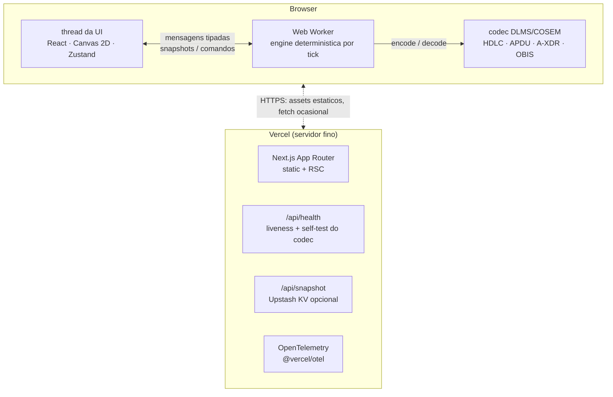
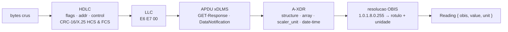

# MeshVigil

**Português** · [English](README.en.md)

**Simulador de rede mesh AMI e console de observabilidade, com um parser DLMS/COSEM real no núcleo.**

[](https://github.com/igorjba/meshvigil/actions/workflows/ci.yml)
[](LICENSE)

<p align="center">
  
</p>

[Como rodar](#como-rodar) · [Garantias](#garantias)

---

## Visão geral

Medidores de energia inteligentes falam por rádio, não por fio. Numa rede AMI
(Advanced Metering Infrastructure), milhares de medidores se organizam sozinhos
em uma malha de rádio e encaminham suas leituras, salto a salto, até pontos de
coleta ligados à concessionária. O problema difícil aparece quando um link de
rádio piora ou um ponto de coleta cai: a rede precisa se reorganizar sozinha, sem
intervenção, para que as leituras continuem chegando. O MeshVigil reproduz essa
rede inteira dentro do navegador — a malha, o roteamento, as falhas e a
recuperação — e mostra o que acontece em tempo real.

O sistema é construído em torno de invariantes verificáveis, não de aparência. A
engine de simulação é determinística: o mesmo estado inicial e o mesmo histórico
de comandos produzem exatamente a mesma saída, sem nenhuma chamada a
`Math.random()`. Cada leitura de telemetria trafega como um frame DLMS/COSEM
real — o mesmo protocolo usado por medidores de verdade — e é decodificada de
volta byte a byte. A raiz da malha não pode ser derrubada por injeção de falha, e
a degradação de rádio nunca ultrapassa o teto configurado. A simulação roda
inteira no cliente, o que remove a classe de falhas de servidor de uma demo.

Por isso o documento abre pelas garantias: cada afirmação acima corresponde a um
teste, e a tabela a seguir traz o comando que prova cada uma antes de qualquer
descrição de funcionalidade.

## Garantias

Cada invariante forte do sistema, com o comando que a verifica:

| Invariante | Comando que a prova |
| --- | --- |
| O codec re-decodifica exatamente o que codificou — encode e decode nunca divergem. | `npx vitest run -t "encoder ↔ parser round-trip"` |
| Toda telemetria emitida pela engine decodifica de volta para a leitura que a gerou. | `npx vitest run -t "every emitted frame parses back"` |
| Um frame com CRC inválido é sinalizado, nunca tratado como válido. | `npx vitest run -t "flags a corrupt FCS"` |
| Mesmo seed e mesmo log de comandos produzem saída idêntica. | `npx vitest run -t "produces identical output"` |
| A degradação de RF nunca ultrapassa o teto configurado. | `npx vitest run -t "degrades RF up to the cap"` |
| O head-end (raiz da malha) não pode ser derrubado por caos. | `npx vitest run -t "refuses the head-end"` |
| O health check só responde `200` se o codec decodificar um frame conhecido. | `npx playwright test health` |
| O console não tem violações de acessibilidade WCAG 2.1 A/AA. | `npx playwright test a11y` |

## Como rodar

```bash
npm install
npm run dev            # http://localhost:3000 — sem configuracao
```

A demo não exige login e faz o próprio seed: a simulação está viva no instante em
que a página carrega.

### Scripts

```bash
npm run dev            # servidor de dev
npm run build          # build de producao
npm run typecheck      # tsc --noEmit
npm run lint           # eslint (flat config)
npm run test           # testes unitarios (Vitest)
npm run coverage       # testes unitarios + thresholds de cobertura
npm run e2e            # Playwright end-to-end (dirige um browser real)
```

---

## Arquitetura

A simulação inteira roda **client-side em um Web Worker**. O worker é o dono do
estado autoritativo e o avança por um timer; a thread da UI renderiza uma
projeção de cada snapshot. O servidor é deliberadamente fino.



### Determinismo

A engine é uma função pura de `(seed, tick, eventos de caos)`. Nenhum
`Math.random()` é chamado em lugar nenhum — todo sorteio estocástico vem de um
PRNG seedado (mulberry32) misturado com o tick atual. Mesmo seed e o mesmo log de
comandos produzem saída byte a byte idêntica. É isso que torna a engine
testável, torna um snapshot compartilhado reproduzível, e permitiria a um browser
e a um servidor concordarem sobre o estado sem uma conexão ativa.

```ts
const a = run(createEngine(config), 20, commands);
const b = run(createEngine(config), 20, commands);
expect(snapshot(a.state, a.sla)).toEqual(snapshot(b.state, b.sla)); // ✓ sempre
```

### O codec DLMS/COSEM

DLMS/COSEM (IEC 62056) é o protocolo dominante de medição inteligente no mundo. O
MeshVigil implementa um subconjunto genuíno dele — não um mock. Cada leitura de
telemetria que a engine emite é **codificada** em um frame on-the-wire, e o
inspector **decodifica** exatamente esses bytes de volta:

```
7E A0 33 03 23 13 …            frame HDLC  (flags, format, addresses, control, HCS/FCS)
   └─ E6 E7 00                 header LLC  (direcao de resposta)
      └─ 0F 00 00 00 01 …       APDU xDLMS  (DataNotification)
            └─ 02 02 …          dado A-XDR  (structure → array de captures)
                 └─ 09 06 01 00 01 08 00 FF   OBIS 1.0.1.8.0.255 → "Active energy import (+A), total"
                 └─ 06 00 12 D6 87            double-long-unsigned → 1 234 567 Wh
```

O caminho de decode é em camadas, e cada camada é testada de forma independente:



O que o torna real:

- **CRC-16/X.25** do header e do frame são calculados e verificados — um frame corrompido é detectado, não confiado. Há um frame de exemplo no inspector com um byte deliberadamente invertido, e o e2e confirma que ele acusa "FCS falhou".
- **A-XDR**: decodificação do CHOICE `Data` do COSEM — inteiros de toda largura, floats, octet/visible strings, booleanos, enums, `date-time` e `array` / `structure` aninhados.
- **OBIS**: os códigos são resolvidos contra um catálogo de registradores padrão (energia, potência, tensão, corrente, relógio, identidade…).
- Um **round-trip completo encoder ↔ parser** é coberto por testes unitários, então as duas direções não podem divergir silenciosamente.

O código está em [`src/lib/dlms`](src/lib/dlms), com os testes em
[`dlms.test.ts`](src/lib/dlms/dlms.test.ts) e [`codec.test.ts`](src/lib/dlms/codec.test.ts).

### Modelo de mesh & RF

- Medidores se agrupam em vizinhanças ao redor dos coletores; os links se formam por um modelo de **path-loss log-distância** (RSSI, SNR, qualidade do link).
- **Reconvergência** é um Dijkstra a partir do head-end a cada tick, custo `1/qualidade` — prefere menos hops mas evita links ruins, o mesmo tradeoff de uma função objetivo real de RPL/AODV.
- Coletor→head-end é **backhaul sempre-ligado** (celular/fibra), imune a ruído RF — que é exatamente por que a perda de um único coletor é sobrevivível e a rede se cura.

### Caos, impacto e recuperação

| Ação | O que faz | Efeito observável |
| --- | --- | --- |
| **Kill collector** | Força um nó de backhaul offline | A vizinhança reroteia; os hop counts sobem; a malha se cura |
| **Degrade RF** | Eleva o piso de ruído passo a passo | Os links fracos caem primeiro; passado o limiar de percolação, a disponibilidade colapsa |
| **Partition** | Corta links ao longo de uma linha divisória | A malha RF se divide em ilhas |
| **Cut link / kill node** | Falha direcionada em um único elemento | Reroteamento local |
| **Restore** | Limpa todas as falhas | A disponibilidade se recupera; o MTTR é registrado |

### Stack

| Área | Escolha |
| --- | --- |
| Framework | Next.js 16 (App Router) · React 19 |
| Linguagem | TypeScript 5.9 (strict, `noUncheckedIndexedAccess`) |
| Estilo | Tailwind CSS v4 |
| Estado | Zustand 5 |
| Simulação | Web Worker · engine determinística por tick · Canvas 2D |
| Testes | Vitest 4 (unit) · Playwright (e2e) |
| Observabilidade | @vercel/otel · health check · error boundaries |
| Persistência (opcional) | Upstash Redis |
| CI/CD | GitHub Actions · Vercel |

### Estrutura do projeto

```
src/
  app/                 # App Router: pagina do console, /sobre, error boundaries, rotas de API
    api/health         # probe de liveness que faz self-test do codec DLMS
    api/snapshot       # persistencia opcional de snapshot (Upstash)
  components/
    console/           # SLA, caos, telemetria, event log, inspector DLMS, top bar
    topology/          # renderizador Canvas com animacao de fluxo de pacotes
    ui/                # primitivos (panel, stat tile, status dot)
  hooks/               # useSimulation — boota o worker, expoe as acoes
  lib/
    dlms/              # o codec DLMS/COSEM (bytes, HDLC, A-XDR, COSEM, OBIS, encoder)
    engine/            # engine mesh deterministica (rng, topology, routing, telemetry, chaos, sla)
    worker/            # protocolo tipado do worker + controller
  store/               # store Zustand (projecao pronta para render)
instrumentation.ts     # registro do OpenTelemetry
e2e/                   # specs do Playwright
```

---

## Alternativas consideradas

As alternativas que foram pesadas e deixadas de lado, com o raciocínio:

- **Ticks server-driven (Redis + Vercel Cron + SSE).** _Rejeitado._ O cron do Hobby roda cerca de uma vez por dia e handlers SSE batem no timeout de função — o oposto exato de um sistema que fica de pé, e ainda força uma dependência externa numa demo que deveria simplesmente funcionar.
- **Engine em Rust → WASM.** _Adiado._ Adiciona um toolchain e um risco real de quebrar o deploy por um ganho de performance que não existe nesta escala. Um Web Worker em TypeScript já entrega execução client-side de custo zero e continua trivialmente testável em Node.
- **Transporte por WebSocket.** _Rejeitado._ Funções serverless não seguram sockets de longa duração. Com a engine no browser não há nada a que se conectar — o problema de transporte desaparece.
- **TypeScript 7 / ESLint 10 gume-vivo.** _Adiado._ As duas ferramentas com maior chance de quebrar o type-checker embutido do build ficaram fixadas nas suas majors comprovadas. Latest onde é seguro (Next 16, React 19, Tailwind 4, Vitest 4); conservador no caminho crítico de deploy.

## Benchmarks

Throughput da engine avançando um mundo fixo, medido com `npm run bench` (Vitest)
em um Intel Core i7-6700 @ 3.40 GHz, Node 24:

| Config | Ticks/s |
| --- | --- |
| 48 medidores · 4 coletores | ~550 |
| 200 medidores · 8 coletores | ~79 |

Cada tick reconverge a malha inteira (Dijkstra a partir do head-end) e emite a
telemetria do ciclo, então o custo por tick cresce com o tamanho da rede.
Reproduzível com `npm run bench`.

## Testes

- **Unitários (Vitest).** Cobrem o codec DLMS (`src/lib/dlms`) e a engine mesh (`src/lib/engine`) — as duas partes puras e de maior carga do sistema. O CI aplica thresholds de cobertura sobre esse núcleo: 85% de linhas, 85% de funções, 78% de ramos (`vitest.config.ts`). Rodar com `npm run coverage`.
- **End-to-end (Playwright).** Dirigem um Chromium real contra o app: o console (`e2e/console.spec.ts`) — que verifica boot do Web Worker, stream de telemetria, injeção de caos e o inspector DLMS acusando FCS ok/falho — e o `/api/health` (`e2e/health.spec.ts`). Rodar com `npm run e2e`.
- **Acessibilidade (axe-core).** `e2e/a11y.spec.ts` roda o axe-core contra o console renderizado e falha se houver qualquer violação WCAG 2.1 A/AA. Rodar com `npx playwright test a11y`.
- O worker e o controller (`src/lib/worker`) são cobertos pela camada e2e, não pela unitária — decisão de escopo declarada no `vitest.config.ts`.

## Observabilidade

- **`GET /api/health`** retorna `200`/`503` e roda o codec DLMS contra um frame conhecido — um check verde significa que o núcleo realmente funciona, não só que o servidor respondeu.
- **OpenTelemetry** ligado via `@vercel/otel`; os spans fluem para o pipeline do Vercel sem configuração no deploy.
- **Error boundaries** (`error.tsx`, `global-error.tsx`) contêm uma falha de render e a mantêm recuperável.

## Segurança & acessibilidade

- **Content-Security-Policy** restritiva, **HSTS** e os headers de hardening usuais (`next.config.ts`); as únicas escritas no servidor (snapshots opcionais) validam o input.
- Operação completa por teclado, anéis de foco visíveis, papéis ARIA e suporte a `prefers-reduced-motion` (`src/app/globals.css`). O console passa no **axe-core** (WCAG 2.1 A/AA) com zero violações, verificado por `npx playwright test a11y`.

## Limitações

O que o projeto deliberadamente não faz:

- Implementa um **subconjunto** do DLMS/COSEM voltado a decodificar leituras (push / GET-Response); não implementa a camada de segurança de aplicação (cifragem, autenticação HLS) nem os serviços de escrita do protocolo.
- A rede, os medidores e a telemetria são **sintéticos**; o sistema não fala com hardware físico nem faz I/O de rádio real.
- Os snapshots opcionais (Upstash) não têm autenticação nem controle de acesso.
- O worker e o controller não têm cobertura unitária — apenas e2e.

## Deploy no Vercel

1. Faça push para o GitHub.
2. Importe o repo no Vercel — ele detecta o Next.js sozinho. Nenhuma variável de ambiente é necessária.
3. _(Opcional)_ defina `UPSTASH_REDIS_REST_URL` / `UPSTASH_REDIS_REST_TOKEN` para habilitar snapshots compartilháveis.

Como a simulação é client-side, o plano Hobby é suficiente — não há processo
persistente, não há dependência de cron, e não há nada para cair por timeout de
função.

## Licença

MIT — veja [LICENSE](LICENSE).

Autoria: Igor Bahia · [github.com/igorjba](https://github.com/igorjba)
