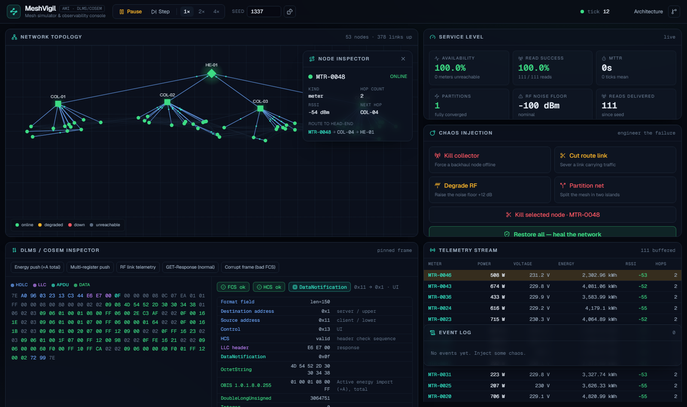
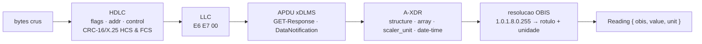
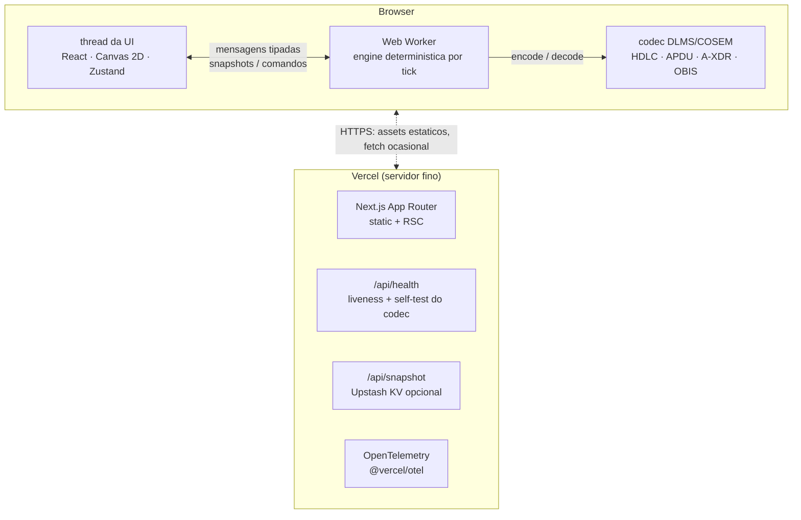

# MeshVigil

**Português** · [English](README.en.md)

**Um simulador de rede mesh AMI e console de observabilidade — com um parser DLMS/COSEM de verdade no coração.**

O MeshVigil simula uma rede RF-mesh de medidores inteligentes roteando através de coletores até um head-end: telemetria sintética, reconvergência da malha ao vivo, injeção de caos e um painel de SLA — tudo sustentado por um codec DLMS/COSEM genuíno que codifica cada leitura em bytes e a decodifica de volta para objetos.

> _Sistema bom é sistema que não cai._ Derrube um coletor, degrade o RF ou particione a rede, e veja a malha reconvergir.

<p align="center">
  
</p>

---

## O que faz

- **Protocolo industrial** — um decodificador DLMS/COSEM (IEC 62056) real: framing HDLC com CRC-16/X.25, APDUs xDLMS, tipos de dado A-XDR, resolução de códigos OBIS.
- **Sistemas distribuídos** — roteamento mesh que reconverge a cada tick, detecção de partição, modelagem de backhaul vs RF.
- **Engenharia de caos** — injeção de falhas direcionada e recuperação observável.
- **Observabilidade** — disponibilidade, taxa de leitura, MTTR, OpenTelemetry e um health check que testa o próprio codec.
- **Client-side por design** — roda de graça no Vercel Hobby e não tem como cair por timeout de serverless, porque a simulação roda inteira no browser.

A [seção de arquitetura](#arquitetura) cobre o tradeoff por trás desse último ponto.

## Demo ao vivo & vídeo

- **Live:** _faça o deploy no Vercel e cole a URL aqui_
- **Walkthrough de 2 minutos:** _link do vídeo da injeção de caos aqui_

A demo não exige login e faz o próprio seed — está viva no instante em que a página carrega.

---

## O coração: um codec DLMS/COSEM de verdade

DLMS/COSEM é o protocolo dominante de medição inteligente no mundo. O MeshVigil implementa um subconjunto genuíno dele — não um mock. Cada leitura de telemetria que a engine emite é **codificada** em um frame on-the-wire, e o inspector **decodifica** exatamente esses bytes de volta:

```
7E A0 33 03 23 13 …            frame HDLC  (flags, format, addresses, control, HCS/FCS)
   └─ E6 E7 00                 header LLC  (direcao de resposta)
      └─ 0F 00 00 00 01 …       APDU xDLMS  (DataNotification)
            └─ 02 02 …          dado A-XDR  (structure → array de captures)
                 └─ 09 06 01 00 01 08 00 FF   OBIS 1.0.1.8.0.255 → "Active energy import (+A), total"
                 └─ 06 00 12 D6 87            double-long-unsigned → 1 234 567 Wh
```

O caminho de decode é em camadas, e cada camada é testada de forma independente:



O que o torna real:

- **CRC-16/X.25** do header e do frame são calculados e verificados — um frame corrompido é detectado, não confiado. (Há um frame de exemplo no inspector com um byte deliberadamente invertido para provar isso.)
- **A-XDR**: decodificação do CHOICE `Data` do COSEM: inteiros de toda largura, floats, octet/visible strings, booleanos, enums, `date-time` e `array` / `structure` aninhados.
- **OBIS**: os códigos são resolvidos contra um catálogo de registradores padrão (energia, potência, tensão, corrente, relógio, identidade…).
- Um **round-trip completo encoder ↔ parser** é coberto por testes unitários, então as duas direções nunca podem divergir silenciosamente.

Veja [`src/lib/dlms`](src/lib/dlms) e seus [testes](src/lib/dlms/dlms.test.ts).

---

## Arquitetura

A simulação inteira roda **client-side em um Web Worker**. O worker é o dono do estado autoritativo e o avança por um timer; a thread da UI renderiza uma projeção de cada snapshot. O servidor é deliberadamente fino.



### Determinismo

A engine é uma função pura de `(seed, tick, eventos de caos)`. **Nenhum `Math.random()` é chamado em lugar nenhum** — todo sorteio estocástico vem de um PRNG seedado (mulberry32) misturado com o tick atual. Mesmo seed e o mesmo log de comandos ⇒ saída byte a byte idêntica. É isso que a torna testável, que torna um snapshot compartilhado reproduzível, e que permitiria a um browser e a um servidor concordarem sobre o estado sem uma conexão ativa.

```ts
const a = run(createEngine(config), 20, commands);
const b = run(createEngine(config), 20, commands);
expect(snapshot(a.state, a.sla)).toEqual(snapshot(b.state, b.sla)); // ✓ sempre
```

### O modelo de mesh & RF

- Medidores se agrupam em vizinhanças ao redor dos coletores; os links se formam por um modelo de **path-loss log-distância** (RSSI, SNR, qualidade do link).
- **Reconvergência** é um Dijkstra a partir do head-end a cada tick, custo `1/qualidade` — prefere menos hops mas evita links ruins, o mesmo tradeoff que uma função objetivo real de RPL/AODV faz.
- Coletor→head-end é **backhaul sempre-ligado** (celular/fibra), imune a ruído RF — que é exatamente por que a perda de um único coletor é sobrevivível e a rede se cura.

### Caos → impacto → recuperação

| Ação | O que faz | O que você observa |
| --- | --- | --- |
| **Kill collector** | Força um nó de backhaul offline | A vizinhança reroteia; os hop counts sobem; a malha se cura |
| **Degrade RF** | Eleva o piso de ruído passo a passo | Os links fracos caem primeiro; passado o limiar de percolação, a disponibilidade colapsa |
| **Partition** | Corta links ao longo de uma linha divisória | A malha RF se divide em ilhas |
| **Cut link / kill node** | Falha direcionada em um único elemento | Reroteamento local |
| **Restore** | Limpa todas as falhas | A disponibilidade se recupera; o MTTR é registrado |

---

## Stack

| Área | Escolha |
| --- | --- |
| Framework | Next.js 16 (App Router) · React 19 |
| Linguagem | TypeScript 5.9 (strict, `noUncheckedIndexedAccess`) |
| Estilo | Tailwind CSS v4 |
| Estado | Zustand 5 |
| Simulação | Web Worker · engine determinística por tick · Canvas 2D |
| Testes | Vitest 4 (unit) · Playwright (e2e) |
| Observabilidade | @vercel/otel · health check · error boundaries |
| Persistência (opcional) | Upstash Redis |
| CI/CD | GitHub Actions · Vercel |

## Como rodar

```bash
npm install
npm run dev            # http://localhost:3000 — sem configuracao
```

### Scripts

```bash
npm run dev            # servidor de dev
npm run build          # build de producao
npm run typecheck      # tsc --noEmit
npm run lint           # eslint (flat config)
npm run test           # testes unitarios (Vitest)
npm run coverage       # testes unitarios + thresholds de cobertura
npm run e2e            # Playwright end-to-end (dirige um browser real)
```

## Estrutura do projeto

```
src/
  app/                 # App Router: pagina do console, /about, error boundaries, rotas de API
    api/health         # probe de liveness que faz self-test do codec DLMS
    api/snapshot       # persistencia opcional de snapshot (Upstash)
  components/
    console/           # SLA, caos, telemetria, event log, inspector DLMS, top bar
    topology/          # renderizador Canvas com animacao de fluxo de pacotes
    ui/                # primitivos (panel, stat tile, status dot)
  hooks/               # useSimulation — boota o worker, expoe as acoes
  lib/
    dlms/              # ★ o codec DLMS/COSEM (bytes, HDLC, A-XDR, COSEM, OBIS, encoder)
    engine/            # engine mesh deterministica (rng, topology, routing, telemetry, chaos, sla)
    worker/            # protocolo tipado do worker + controller
  store/               # store Zustand (projecao pronta para render)
instrumentation.ts     # registro do OpenTelemetry
e2e/                   # specs do Playwright
```

## Observabilidade

- **`GET /api/health`** retorna `200`/`503` e roda o codec DLMS contra um frame conhecido — um check verde significa que o núcleo realmente funciona, não só que o servidor respondeu.
- **OpenTelemetry** ligado via `@vercel/otel`; os spans fluem para o pipeline do Vercel sem configuração no deploy.
- **Error boundaries** (`error.tsx`, `global-error.tsx`) contêm uma falha de render e a mantêm recuperável.

## Segurança & acessibilidade

- **Content-Security-Policy** restritiva, **HSTS** e os headers de hardening usuais; as únicas escritas no servidor (snapshots opcionais) validam o input.
- Passa no **axe-core** (WCAG 2.1 AA) com zero violações; operação completa por teclado, anéis de foco visíveis e suporte a `prefers-reduced-motion`.

## Deploy no Vercel

1. Faça push para o GitHub.
2. Importe o repo no Vercel — ele detecta o Next.js sozinho. Nenhuma variável de ambiente é necessária.
3. _(Opcional)_ defina `UPSTASH_REDIS_REST_URL` / `UPSTASH_REDIS_REST_TOKEN` para habilitar snapshots compartilháveis.

Como a simulação é client-side, o plano Hobby é mais que suficiente — não há processo persistente, não há dependência de cron, e não há nada para cair por timeout de função.

---

## Alternativas consideradas

As alternativas que foram pesadas e deixadas de lado, com o raciocínio:

- **Ticks server-driven (Redis + Vercel Cron + SSE).** _Rejeitado._ O cron do Hobby roda cerca de uma vez por dia e handlers SSE batem no timeout de função — o oposto exato de um sistema que fica de pé, e ainda força uma dependência externa numa demo que deveria simplesmente funcionar.
- **Engine em Rust → WASM.** _Adiado._ Adiciona um toolchain e um risco real de quebrar o deploy por um ganho de performance que não existe nesta escala. Um Web Worker em TypeScript já entrega execução client-side de custo zero e escala infinita — e continua trivialmente testável em Node.
- **Transporte por WebSocket.** _Rejeitado._ Funções serverless não seguram sockets de longa duração. Com a engine no browser não há nada a que se conectar — o problema de transporte desaparece.
- **TypeScript 7 / ESLint 10 gume-vivo.** _Adiado._ Fixei as duas ferramentas com maior chance de quebrar o type-checker embutido do build nas suas majors comprovadas. Latest onde é seguro (Next 16, React 19, Tailwind 4, Vitest 4); conservador no caminho crítico de deploy.

---

## Licença

MIT — veja [LICENSE](LICENSE).
